# Data Flow Documentation

## Overview

This document describes the complete request flow through the Order Processing system, from file upload in Teams to draft sales order creation in Zoho Books.

The system runs on a VM-only architecture using Temporal for workflow orchestration, with an Express.js API server handling HTTP requests and triggering Temporal workflows.

## High-Level Flow

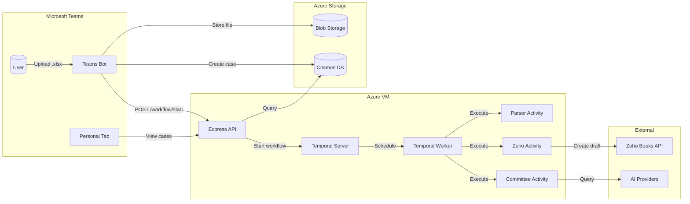

## Detailed Flow Diagrams

### 1. File Upload Flow

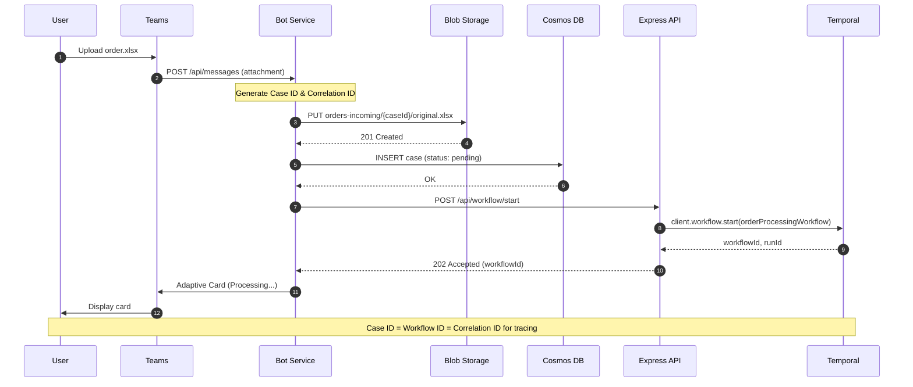

### 2. Parsing Phase

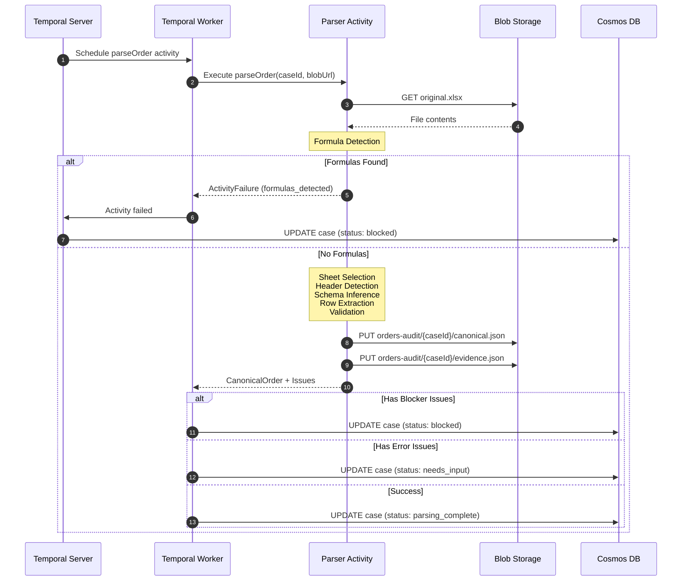

### 3. Committee Review

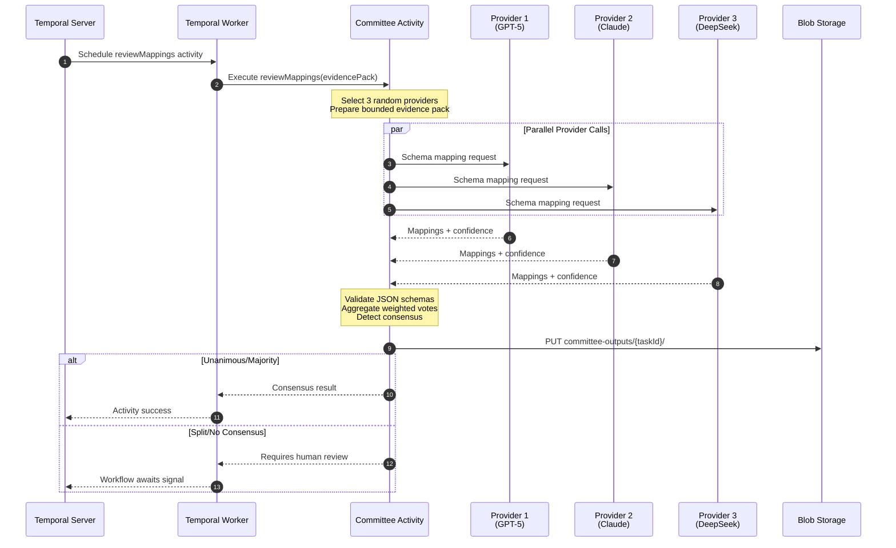

### 4. Human Correction Flow (Temporal Signals)

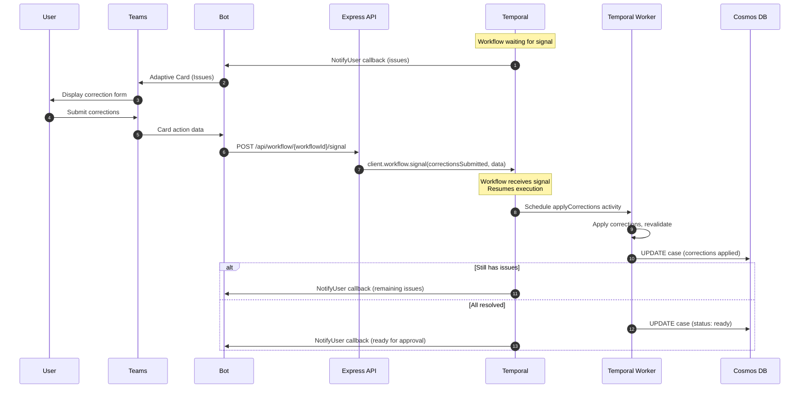

### 5. Entity Resolution

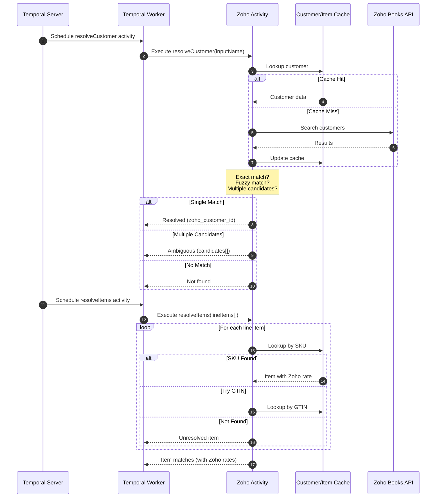

### 6. Approval and Creation

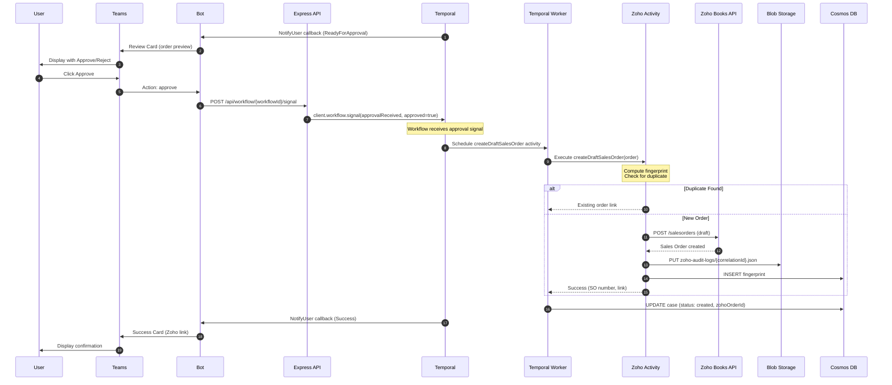

### 7. Workflow State Machine (Temporal)

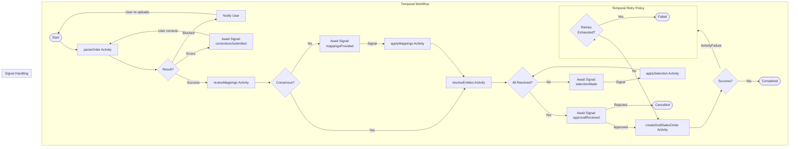

## Data Structures

### Case Record (Cosmos DB)

```json
{
  "id": "case_abc123",
  "caseId": "case_abc123",
  "tenantId": "tenant-guid",
  "userId": "user-guid",
  "status": "ready",
  "fingerprint": "sha256:...",
  "createdAt": "2025-12-25T10:00:00Z",
  "updatedAt": "2025-12-25T10:05:00Z",
  "blobPrefix": "orders-incoming/case_abc123/",
  "fileName": "order.xlsx",
  "fileSha256": "abc123...",
  "customerName": "Acme Corp",
  "zohoCustomerId": null,
  "zohoOrderId": null,
  "zohoOrderNumber": null,
  "temporalWorkflowId": "order-case_abc123",
  "temporalRunId": "run-xyz789",
  "correlationId": "case_abc123"
}
```

### Audit Event (Blob Storage)

```json
{
  "ts": "2025-12-25T10:01:00Z",
  "sequence": 3,
  "event_type": "PARSE_COMPLETE",
  "case_id": "case_abc123",
  "tenant_id": "tenant-guid",
  "correlation": {
    "trace_id": "abc",
    "span_id": "def",
    "case_id": "case_abc123",
    "temporal_workflow_id": "order-case_abc123",
    "temporal_run_id": "run-xyz789"
  },
  "actor": {
    "type": "system",
    "service": "parser-activity"
  },
  "data": {
    "lines_extracted": 15,
    "issues_count": 2,
    "confidence": 0.92,
    "detected_language": "en"
  },
  "pointers": {
    "canonical_order": "orders-audit/case_abc123/canonical.json",
    "evidence": "orders-audit/case_abc123/evidence.json"
  }
}
```

### Fingerprint Record (Cosmos DB)

```json
{
  "id": "fp_sha256:abc...",
  "fingerprint": "sha256:abc123def456...",
  "caseId": "case_abc123",
  "tenantId": "tenant-guid",
  "zohoOrderId": "so_123",
  "zohoOrderNumber": "SO-00042",
  "createdAt": "2025-12-25T10:10:00Z"
}
```

### Committee Output (Blob Storage)

```json
{
  "taskId": "task_xyz789",
  "caseId": "case_abc123",
  "temporalWorkflowId": "order-case_abc123",
  "timestamp": "2025-12-25T10:02:00Z",
  "selectedProviders": [
    "azure-gpt-5.2",
    "azure-claude-opus-4.5",
    "azure-deepseek-v3.2"
  ],
  "providerOutputs": [
    {
      "providerId": "azure-gpt-5.2",
      "mappings": [...],
      "confidence": 0.94,
      "latencyMs": 1523
    }
  ],
  "aggregatedResult": {
    "consensus": "majority",
    "finalMappings": {...},
    "disagreements": [],
    "overallConfidence": 0.91
  },
  "requiresHumanReview": false,
  "executionTimeMs": 2341
}
```

## Correlation ID Propagation

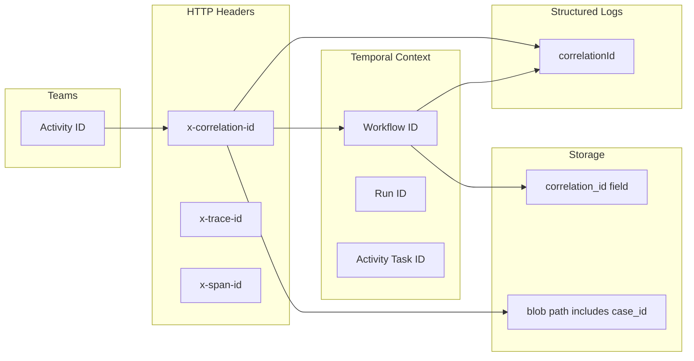

### Correlation Context Structure

```typescript
interface CorrelationContext {
  // End-to-end trace ID (same across all services)
  trace_id: string;

  // Current operation span
  span_id: string;

  // Parent span for distributed tracing
  parent_span_id?: string;

  // Business correlation (= case ID)
  case_id: string;

  // Teams-specific IDs
  teams_activity_id?: string;
  teams_conversation_id?: string;

  // Temporal workflow context
  temporal_workflow_id: string;
  temporal_run_id: string;
  temporal_activity_id?: string;
}
```

### Propagation Methods

| Channel | Method |
|---------|--------|
| HTTP Requests | `x-correlation-id`, `x-trace-id` headers |
| Temporal Workflows | Workflow ID, Run ID in context |
| Temporal Activities | Activity context propagation |
| Cosmos DB | Document fields (`correlationId`, `caseId`, `temporalWorkflowId`) |
| Blob Storage | Path includes case ID |
| Structured Logs | `correlationId`, `workflowId` fields |

## Service Interactions

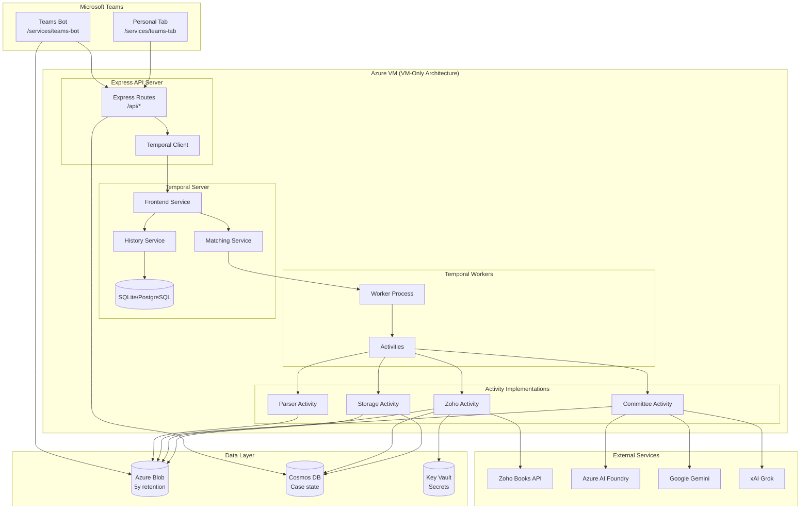

## Temporal Retry and Error Handling

### Activity Retry Policy

Temporal provides built-in retry handling for activities. Each activity type has a configured retry policy:

```typescript
// Default retry policy for activities
const defaultRetryPolicy: RetryPolicy = {
  initialInterval: '1s',
  backoffCoefficient: 2.0,
  maximumInterval: '1h',
  maximumAttempts: 6,
  nonRetryableErrorTypes: [
    'ValidationError',
    'DuplicateOrderError',
    'AuthenticationError'
  ]
};

// Zoho API activity (more aggressive retries for rate limiting)
const zohoRetryPolicy: RetryPolicy = {
  initialInterval: '1m',
  backoffCoefficient: 2.0,
  maximumInterval: '1h',
  maximumAttempts: 6,
  nonRetryableErrorTypes: [
    'DuplicateOrderError',
    'InvalidPayloadError'
  ]
};
```

### Retry Flow Diagram

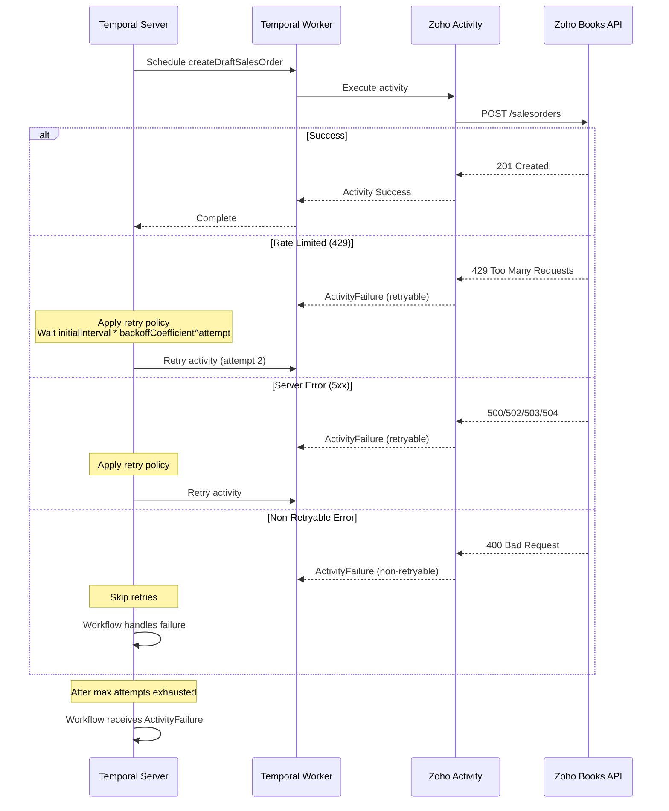

### Exponential Backoff Schedule (Temporal Managed)

| Attempt | Delay (Zoho) | Cumulative |
|---------|--------------|------------|
| 1 | 1 minute | 1 minute |
| 2 | 2 minutes | 3 minutes |
| 3 | 4 minutes | 7 minutes |
| 4 | 8 minutes | 15 minutes |
| 5 | 16 minutes | 31 minutes |
| 6 | 32 minutes | 63 minutes |

### Workflow-Level Error Handling

```typescript
// In workflow definition
async function orderProcessingWorkflow(input: OrderInput): Promise<OrderResult> {
  try {
    // Activities are automatically retried per their retry policy
    const parseResult = await parseOrder(input.caseId, input.blobUrl);

    if (parseResult.hasBlockers) {
      // Workflow waits for signal to continue
      await condition(() => correctionReceived, '7d');
    }

    const reviewResult = await reviewMappings(parseResult.evidence);

    // ... rest of workflow

  } catch (error) {
    if (error instanceof ActivityFailure) {
      // All retries exhausted - update case status
      await updateCaseStatus(input.caseId, 'failed', error.message);
      throw error;
    }
    throw error;
  }
}
```

## Workflow Monitoring (Temporal Web UI)

The Temporal Web UI provides comprehensive workflow monitoring at `http://<vm-ip>:8080`:

### Monitoring Capabilities

| Feature | Description |
|---------|-------------|
| Workflow List | View all running, completed, and failed workflows |
| Workflow Detail | Inspect workflow history, inputs, outputs |
| Activity Timeline | Visual timeline of activity executions |
| Signal History | View all signals sent to workflows |
| Query Workflows | Execute queries to get workflow state |
| Retry Operations | Manually retry failed activities |
| Cancel/Terminate | Stop running workflows |

### Workflow States in UI

| State | Description |
|-------|-------------|
| Running | Workflow actively executing or waiting for signal |
| Completed | Workflow finished successfully |
| Failed | Workflow failed after all retries exhausted |
| Cancelled | Workflow was manually cancelled |
| Terminated | Workflow was forcefully terminated |
| TimedOut | Workflow exceeded execution timeout |

### Accessing Workflow Details

```bash
# Via Temporal CLI (tctl)
tctl workflow describe --workflow_id order-case_abc123

# List running workflows
tctl workflow list --query "ExecutionStatus='Running'"

# Send signal to workflow
tctl workflow signal --workflow_id order-case_abc123 \
  --name correctionsSubmitted \
  --input '{"corrections": [...]}'
```
